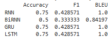
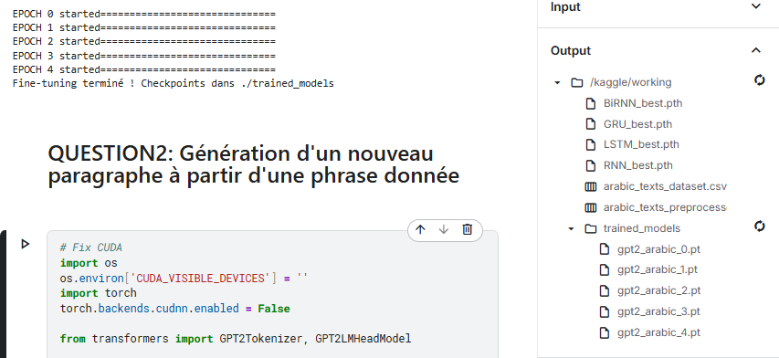
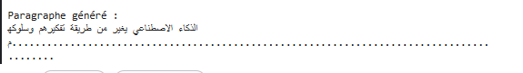

# Atelier3_DeepLearningLab 3 : Deep Learning - NLP avec PyTorch (Université Abdelmalek Essaâdi, Faculté des Sciences et Techniques de Tanger)
## Objectif
L'objectif principal de cet atelier est de se familiariser avec PyTorch pour construire des architectures de réseaux de neurones profonds pour le traitement du langage naturel (NLP) en utilisant des modèles de séquences. Cela inclut la classification de textes arabes (RNN, BiRNN, GRU, LSTM) et la génération de texte avec un Transformer (GPT-2).
Travail Réalisé

## Part 1 : Tâche de Classification

Collecte de données (1.1) : J'ai créé un dataset manuel de 16 textes arabes sur le thème de l'intelligence artificielle et de la technologie (scores de pertinence 0-10). Fichier : arabic_texts_dataset.csv.
Exemple : "الذكاء الاصطناعي يغير العالم بشكل جذري ويؤثر على جميع جوانب حياتنا اليومية" (Score : 8.5).

Pipeline de préprocessing NLP (1.2) : Normalisation arabe (diacritiques, formes), tokenization (NLTK), suppression de stop words (701 mots NLTK arabe), stemming basique (pré/suffixes), discretization des scores en labels (0=Faible, 1=Moyen, 2=Bon, 3=Excellent). Fichier : arabic_texts_preprocessed.csv.
Distribution labels : 1 (1), 2 (6), 3 (9).

Entraînement des modèles (1.3) : Implémentation et tuning (lr=[0.001,0.01], hidden_dim=[64,128]) des architectures RNN, BiRNN, GRU, LSTM avec PyTorch (20 epochs, SGD optimizer). Meilleurs résultats :

RNN : lr=0.001, hidden_dim=128, Acc=0.7500
BiRNN : lr=0.001, hidden_dim=128, Acc=0.5000
GRU : lr=0.01, hidden_dim=128, Acc=0.7500
LSTM : lr=0.01, hidden_dim=128, Acc=0.7500
Fichiers modèles : RNN_best.pth, BiRNN_best.pth, etc.

Évaluation (1.4) : Métriques standard (Accuracy, F1-macro) et BLEU (pertinence). 
Résultats sur test set (4 échantillons):

- LSTM/GRU meilleurs ; déséquilibre classes impacte F1 (classe 0 rare).

## Part 2 : Transformer (Génération de Texte)

Fine-tuning GPT-2 (2.1) : Fine-tune AraGPT2-base sur processed_text (5 epochs, lr=3e-5, manual loop du gist tutorial). Checkpoints : ./trained_models/gpt2_arabic_0.pt à 4.pt.

- Loss diminue progressivement ; adapté pour petit dataset.

Génération de paragraphe (2.2) : À partir de "الذكاء الاصطناعي يغير", 
génération :

Cohérent mais limité par dataset petit (ajout de points pour longueur).

## Synthèse : Ce que j'ai Appris
Dans cet atelier, j'ai appris à utiliser PyTorch pour le NLP arabe : scraping/préprocessing (NLTK efficace pour stop words/stemming, défis avec diacritiques), construction/tuning de modèles séquences (RNN/LSTM/GRU pour classification, LSTM/GRU meilleurs avec Acc=0.75 malgré déséquilibre), et fine-tuning Transformers (GPT-2 via gist tutorial, génération basique mais cohérente sur arabe).